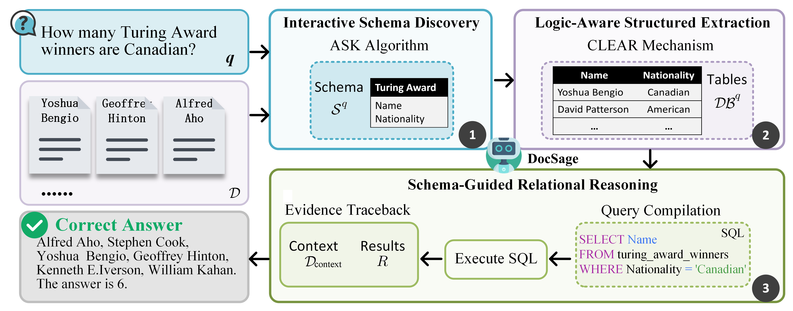

# DocSage

## 👀Overview
This repository contains code for our paper: DocSage: An Information Structuring Agent for Multi-Doc Multi-Entity Question Answering. Our experiments on multi-document QA benchmarks, MEBench and Loong, demonstrate a 27.2% and 27% improvement over state-of-the-art methods, proving that structured data transformation fundamentally enhances LLMs' reasoning capabilities.

**DocSage pipeline**

  

## 📦 Dataset
**[👉 Access the MEBench dataset 👈](https://github.com/tl2309/MEBench)**

**[👉 Access the Loong dataset 👈](https://github.com/MozerWang/Loong)**

## 🔧Evaluate 

docsage/evaluate.py

